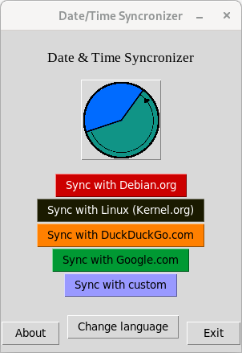

**Project moved to [CodeBerg](https://codeberg.org/Palace4Software/timesync).**

# timesync
Program to sync the time with different (preset) servers and also a custom server function. Written for Debian GNU/Linux and systems they based on it. 



## The application
### How to install the application?
#### Method 1 - .deb -Package
1. Download "timesync-{version}.deb" from the [Releases-section](https://github.com/Palace4Software/timesync/releases).
2. Open the Downloads-folder with your file manager.
3. Double click the downloaded .deb -file and open it with your software manager (or graphical package installation program (like gdebi, ...))
4. Install the application.
    - _You have to replace "{version}" with the version you downloaded (for example "timesync-1.1.0.deb")._

#### Method 2 - .deb -Package (via terminal)
1. Download "timesync-{version}.deb" from the Releases-section.
2. Start the terminal.
3. Type ``` sudo apt install /Downloads/timesync-{version}.deb ```
    - _You have to replace "{version}" with the version you downloaded (for example "timesync-1.1.0.deb")._


### How to start the application?
* In your applications (e.g. GNOME application list, Start menu, or Mint menu), there should be a new application called "Time and Date Synchronization". You can launch it by clicking on it.
* If you need a debugging-enviroment, you can start the application from the terminal by typing: ``` timesync ```


### How to use the application?
#### Preset server
1. Start the application by clicking on the entry in your menu.
2. Press on the server you'd like to sync your date and time with.
3. Enter your password (or the root password) and press enter.
4. Time and date should now be synced.

#### Custom server
1. Start the application by clicking on the entry in your menu.
2. Press on "Sync with custom".
3. Enter the server or website you'd like to sync with (e.g. opensource.org) and click the "Sync" button. You can also type in IP-Adresses. *(Not every website/server allows time synchronization! If it is not possible to sync, the time is automatically set to 0 o'clock.)*
4. Enter your password (or the root password) and press enter.
5. Time and date should now be synced.


## Building
### How to build the .deb -Package
1. Download the timesync repository (see website below) and extract all the files. (Maybe you should download the source-code from the release-section, because the raw repository can contain unstable features and code.)
2. Extract the downloaded source code and open the folder.
3. Run the "build-deb.sh" script.
4. Now you got a new folder, called "installer". Here you can find the builded .deb -file. Just run it to install the application.


## Compatiblity
* This program (also the manual installer) is written for Debian GNU/Linux or Linux distributions based on it.
* You need python3 and python3-tk (Tkinter) in version 3.10.0 (or higher) to run the program. Also the packages python3-platformdirs, pkexec, wget, sed and fonts-liberation2. These are downloaded automatically during installation.


## Website
* See https://github.com/Palace4Software/timesync for updates and informations and source code
* See https://github.com/Palace4Software/timesync/commits/main for changelog
